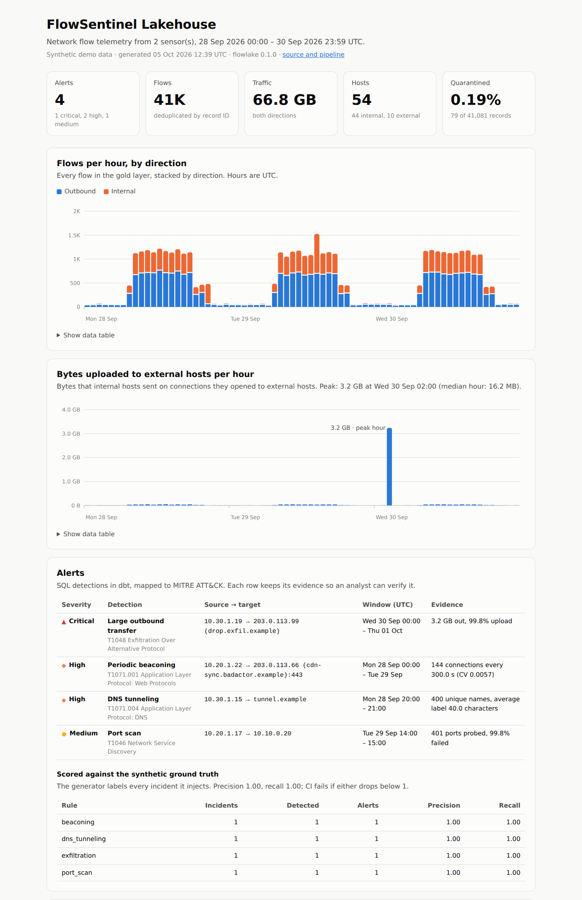
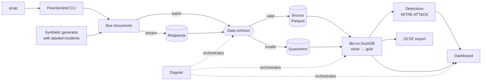

# FlowSentinel Lakehouse

[](https://github.com/exosphere8/flowsentinel-lakehouse/actions/workflows/ci.yml)
[](https://github.com/exosphere8/flowsentinel-lakehouse/actions/workflows/pages.yml)
[](pyproject.toml)
[](LICENSE)

A security data lakehouse for network flow telemetry. It takes the flow records produced by
[FlowSentinel](https://github.com/exosphere8/flowsentinel), my Rust network sensor, through a
data contract and a quarantine into Parquet, by batch or by streaming through Kafka (Redpanda).
dbt models on DuckDB turn them into tested facts, dimensions and SQL threat detections mapped
to MITRE ATT&CK, and Dagster orchestrates it all.

The sensor decodes packets into flows; this project is the data platform behind it.



## Highlights

| Data engineering problem | How it is handled here |
| --- | --- |
| Untrusted input | A strict **data contract** (pydantic, published as JSON Schema) checks every record. Failures go to a **quarantine** with the reason and raw record, never dropped. |
| Producer changes | A **consumer-driven contract test** builds FlowSentinel at a pinned commit in CI and fails if its output stops matching the contract, field for field. |
| Re-runs and replays | **Idempotent batches** (content-hashed IDs, atomic file writes, a batch ledger) and **deterministic record IDs** give effectively-once results even when Kafka replays a topic. |
| Batch and streaming | Files and a **Redpanda** topic feed the same bronze layer through the same writer. The consumer commits offsets only after its batch is durable. |
| Late-arriving data | Bronze is partitioned by **ingestion date**. Incremental dbt models use a **watermark with a lookback**, and the hourly aggregate **recomputes only the hours that changed**. A test proves incremental runs equal a full refresh. |
| History | A **type 2 slowly changing dimension** of hostnames per IP, derived from event time with a gaps-and-islands query. |
| Analytics engineering | A **medallion** model in **dbt + DuckDB**: 14 models, 5 seeds, 48 data tests, 4 dbt unit tests, a reconciliation test and source freshness. |
| Security analytics | Four **SQL detections** (port scan, C2 beaconing, DNS tunneling, exfiltration) with evidence and **MITRE ATT&CK** mapping, scored for **precision and recall** against labeled ground truth in CI. Flows are also exported as **OCSF** events. |
| Orchestration | **Dagster** software-defined assets: dbt models as assets, dbt tests as asset checks, a landing-directory sensor and an hourly schedule. |
| Engineering hygiene | 70 pytest tests (end to end, Kafka, Dagster, upstream contract), `mypy --strict`, ruff, a lockfile, CI on Python 3.11 and 3.13, mutation-checked incremental tests. |

## Architecture



The design decisions and their trade-offs are in [docs/architecture.md](docs/architecture.md).

## Quick start

Requirements: [uv](https://docs.astral.sh/uv/) (it fetches a suitable Python), and Docker
only for the streaming path.

```bash
git clone https://github.com/exosphere8/flowsentinel-lakehouse.git
cd flowsentinel-lakehouse
make install     # uv sync --all-extras
make demo        # generate, ingest, dbt build, score detections, write site/index.html
```

`make demo` takes about 15 seconds and ends with the detection scores:

```text
rule            incidents detected alerts precision recall
beaconing               1        1      1      1.00   1.00
dns_tunneling           1        1      1      1.00   1.00
exfiltration            1        1      1      1.00   1.00
port_scan               1        1      1      1.00   1.00
overall                                        1.00   1.00
quarantine matches the injected corruptions: expected {...}, got {...}
```

Open `site/index.html` for the dashboard. The warehouse is `lake/warehouse.duckdb`; query it
with the `duckdb` CLI or from Python, for example `select * from gold.fct_alerts`.

### Streaming through Redpanda

```bash
make stream-demo   # starts Redpanda, publishes one synthetic day, consumes it, runs dbt
```

Or step by step: `docker compose up -d --wait`, then `uv run flowlake stream produce`, then
`uv run flowlake stream consume --idle-timeout 10`. Add `--profile ui` to the Compose command
for Redpanda Console on <http://localhost:8081>.

### Orchestration with Dagster

```bash
make dagster       # http://localhost:3000
```

Materialize everything from the UI, or turn on the `new_landing_files` sensor and drop files
into `landing/sensor=<id>/`.

### Real captures

Build FlowSentinel (`cargo build --release -p cli` in its repository), then:

```bash
export FLOWSENTINEL_BIN=/path/to/flowsentinel/target/release/flowsentinel
uv run flowlake ingest capture.pcap --sensor office   # or a directory of pcaps/JSON
uv run flowlake transform
uv run flowlake report
```

`flowlake ingest` also accepts the JSON that `flowsentinel flows --json` prints, so captures can
be decoded on the sensor and shipped as JSON.

## The data model

| Layer | Tables | Notes |
| --- | --- | --- |
| Bronze (Parquet) | `bronze/flows`, `bronze/quarantine` | Partitioned by `ingest_date`; one file per batch |
| Silver (views) | `stg_flowsentinel__flows`, `stg_flowsentinel__quarantine`, `stg_network_zones` | Typing, derived columns, CIDR ranges |
| Gold (tables) | `fct_flows` (incremental), `dim_hosts`, `dim_host_names_scd2`, `agg_traffic_hourly` (incremental), `dq_batches` | Deduplicated, zone and direction classified |
| Gold, security | `det_port_scan`, `det_beaconing`, `det_dns_tunneling`, `det_exfiltration`, `fct_alerts` | One model per rule, unioned with evidence and ATT&CK names |
| Export | `ocsf_network_activity` | OCSF 1.3 Network Activity (class 4001) |
| Reference (seeds) | `network_zones`, `service_ports`, `detection_rules`, `mitre_techniques`, `detection_allowlist` | Configuration as versioned data |

## Detections

| Rule | Logic (defaults in `transform/dbt_project.yml`) | ATT&CK |
| --- | --- | --- |
| Port scan | One source probes ≥ 50 distinct TCP ports on one host within an hour, ≥ 80% failed | T1046 |
| Beaconing | ≥ 20 outbound connections a day to one endpoint, gaps 10 s–1 h apart with coefficient of variation ≤ 0.2; allowlist for NTP | T1071.001 |
| DNS tunneling | ≥ 50 distinct names under one parent domain within an hour, average leftmost label ≥ 20 characters | T1071.004 |
| Exfiltration | ≥ 500 MB uploaded to one external host in a day, ≥ 80% of the traffic upload | T1048 |

Every alert keeps its evidence (for example the beacon's mean interval and coefficient of
variation) so an analyst can verify it.

## How it is tested

| Layer | What runs | Where |
| --- | --- | --- |
| Contract | Every real FlowSentinel fixture flow validates; each rule violation has a typed error; schemas match the models | `tests/test_contract.py` |
| Upstream | Builds FlowSentinel at a pinned commit, checks every flow from its fixtures and the exact field set | CI job `upstream-contract` |
| Ingestion | Idempotency, `--force`, parallel equals serial, rejected vs failed inputs, pcaps through the CLI | `tests/test_ingest.py`, `tests/test_bronze.py` |
| Streaming | Against a real Redpanda: streamed and file-ingested data are identical, offsets committed, a full replay leaves gold unique | `tests/test_streaming.py`, CI job `streaming` |
| dbt | 48 data tests, 4 unit tests on the detection and CIDR logic, reconciliation and SCD2 invariants | `transform/`, run by `dbt build` |
| End to end | Precision and recall of 1.0 on ground truth, incremental equals full refresh with late data, replays, empty lake, OCSF shape | `tests/test_pipeline.py` |
| Orchestration | The Dagster job materializes every asset in-process; the sensor fires once per new file | `tests/test_orchestration.py` |

`make check` runs the linters and the tests that need no broker; `make test-all` adds Redpanda.

## Benchmarks

Measured with [`scripts/benchmark.py`](scripts/benchmark.py) on a 4-vCPU Linux container with
Python 3.12: seven days of synthetic traffic from 600 workstations, 336 hourly captures and
**1,065,654 flows**.

| Step | Time |
| --- | ---: |
| Ingest: validate every record, quarantine, write Parquet (4 processes) | 24.8 s (≈ 43,000 flows/s) |
| `dbt build` from scratch: 14 models, 5 seeds, 52 tests | 18.5 s |
| Incremental `dbt build` after one late capture arrives | 9.0 s |

* **Storage:** 1,352 MB of landing JSON became 134 MB of Parquet in bronze, about 10 times
  smaller.
* **Detections at scale:** precision 1.00 and recall 1.00 over 1.06 million flows; no false
  positives.
* **Where incremental time goes:** merging the late capture into `fct_flows` takes 0.7 s. Most of
  the rest is dbt start-up and the detection tables, which are rebuilt in full by design (see
  [docs/architecture.md](docs/architecture.md#what-would-change-at-100x-scale)).
* The incremental runs use a lookback of 0. The whole history was loaded seconds earlier, so the
  default 30-minute lookback would re-read all of it; in steady state earlier loads are older
  than the lookback.
* Generating the synthetic data took 93 s; it is not part of the pipeline.

## Repository layout

```text
src/flowlake/
  contract.py        the data contract (pydantic) and JSON Schema export
  bronze.py          Parquet layout, atomic batch writer, quarantine, ledger
  ingest.py          file and pcap ingestion, parallel across files
  streaming.py       Kafka producer and micro-batching consumer
  sources/           FlowSentinel adapter and the synthetic traffic generator
  transform.py       runs dbt for a lake
  evaluate.py        scores detections against ground truth
  report.py          the static dashboard
  orchestration.py   Dagster definitions
  cli.py             the `flowlake` command
transform/           the dbt project (models, seeds, macros, tests)
contracts/           generated JSON Schemas
scripts/benchmark.py the benchmark below
tests/               pytest suite, with real FlowSentinel output as fixtures
docs/architecture.md design decisions and trade-offs
```

## Data and safety

The synthetic data uses private (RFC 1918) and documentation (RFC 5737) addresses and reserved
domain names (RFC 2606), so it never points at a real host. FlowSentinel itself keeps only
metadata, never payloads; see its [README](https://github.com/exosphere8/flowsentinel#readme).
Only analyze traffic you own or are authorized to inspect.

## License

[MIT](LICENSE)
