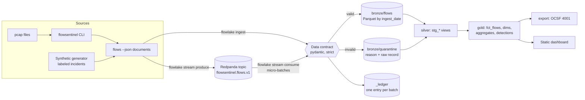

# Architecture and design decisions

This document explains how the lakehouse is put together and why. The README covers what it
does and how to run it.

## Data flow

Everything runs on one machine with no services except the optional broker: Parquet files on
disk, DuckDB as the query engine, dbt for transformations, Dagster for orchestration.

## Layers

| Layer | Where | Written by | Contents |
| --- | --- | --- | --- |
| Landing | `landing/sensor=<id>/*.json, *.pcap` | FlowSentinel or the generator | Raw captures as produced |
| Bronze | `lake/bronze/{flows,quarantine}/ingest_date=…/<batch>.parquet` | `flowlake.bronze.BatchWriter` | Contract-checked, flattened records; rejected records with their reason |
| Ledger | `lake/_ledger/<batch>.json` | the same writer, last | What each batch read, wrote and rejected |
| Silver | DuckDB schema `silver` (views) | dbt | Typed, derived columns; not yet deduplicated |
| Gold | DuckDB schema `gold` (tables) | dbt | Deduplicated facts, dimensions, aggregates, detections, data-quality marts |
| Export | DuckDB schema `export` (views) | dbt | OCSF Network Activity events |

## Decisions

### 1. A data contract at the door, enforced in code and published as JSON Schema

FlowSentinel's flow record is a Rust struct; the lakehouse mirrors it as strict pydantic models
(`flowlake.contract`). Strict means `"5"` is not an integer and `true` is not a count. On top of
the structural rules, the contract adds the guarantees the SQL relies on: an event time exists,
time does not run backwards, per-direction counters add up to the totals, and addresses match the
IP version. Checking these once, at ingestion, means no model has to defend against them.

The JSON Schemas in `contracts/` are generated from the models, and CI fails if they drift
(`flowlake contract --check`), so the published contract can never disagree with the code.

**Tolerant reader.** New fields upstream are ignored, and enum-like fields accept any value.
dbt `accepted_values` tests on those columns are set to *warn*, so a new TCP state shows up as a
warning instead of a stopped pipeline. Fields that are removed or renamed are caught earlier by
the next decision.

### 2. Consumer-driven contract test against the real producer

The `upstream-contract` CI job builds FlowSentinel at a pinned commit, runs it on its own pcap
fixtures, and checks that every flow passes the contract and that the set of fields is exactly
the contract's. A change upstream that would break the lakehouse fails CI here first; bumping
`FLOWSENTINEL_REF` is a deliberate act.

### 3. Quarantine, never drop

A record that fails the contract is written to `bronze/quarantine` with the first error's type
(for example `totals_mismatch`), the full message and the raw record. Nothing is silently lost.
`gold.dq_batches` reports the quarantine rate per batch, a dbt test warns above 5%, and a Dagster
asset check does the same for the whole lake. A whole capture that FlowSentinel rejected (not a
pcap, truncated, ...) is recorded in the ledger as `rejected`, with the reason.

Rejections are deterministic, so they are ledgered and not retried. Operational failures (the
`flowsentinel` binary is missing, a timeout) are reported as `failed` and *not* ledgered, so the
next run retries them.

### 4. Bronze is partitioned by ingestion date, not event date

Late data is normal for sensors: a laptop comes back online, a branch link is down for a day.
If bronze were partitioned by event date, late records would land in old partitions and an
incremental reader would have to rescan history to find them. Partitioned by ingestion date,
late records land in today's partition like everything else, and incremental models find them
by `ingested_at`. Event-time organization happens later, in the gold models (`flow_hour`,
`event_date`), where it is needed for analysis.

### 5. Idempotent batches and effectively-once delivery

Each input has a deterministic batch ID: a content hash for a file (per sensor), or the
topic/partition/offset ranges for a Kafka micro-batch. Files are written to a temporary name and
renamed into place, so readers never see partial files, and the ledger entry is written last.
Re-running ingestion skips finished batches; `--force` rewrites the same file names.

Records get a deterministic ID: `sha256(sensor, capture, flow_id)`. The same flow has the same ID
whether it arrives as a file or over Kafka, and whether it arrives once or five times. The Kafka
consumer commits offsets only after a batch's files and ledger entry exist, which gives
at-least-once delivery; `fct_flows` keeps one row per record ID, which turns that into
**effectively-once** in the gold layer. `tests/test_streaming.py` replays a whole topic into the
same lake and checks that bronze doubles while `fct_flows` does not.

### 6. Incremental models that stay correct with late data

`fct_flows` is incremental with `delete+insert` on `record_id`. Each run reads bronze rows with
`ingested_at` later than the newest row it already has, minus a lookback window
(`incremental_lookback_minutes`, default 30). The lookback covers batches that were stamped just
before but became visible just after the previous run read bronze; rows read twice are replaced,
not duplicated. A predicate on `ingest_date` lets DuckDB skip old partitions without opening them.

`agg_traffic_hourly` cannot simply append: a late flow changes an *old* hour. Each run finds the
hours that received new or replaced flows (by `fct_flows.loaded_at`) and recomputes those hours
completely, replacing them with `delete+insert` on `hour_start`.

Two tests keep this honest. `test_incremental_runs_with_late_data_match_a_full_refresh` loads
data in three rounds, one of them containing a capture from 03:00 on the first day, and compares
every gold table with a full refresh. It also checks that rows outside the lookback window were
not rewritten. A reconciliation test in dbt checks that the hourly aggregate accounts for every
flow and byte in the fact table. Both were mutation-checked: making the aggregate append-only
breaks the build, and dropping the empty-target guard on the watermark loses all rows.

### 7. Slowly changing dimension from event time

`dim_host_names_scd2` records which hostname each IP address served over time. It is not built
with dbt snapshots, which capture state at the time the pipeline *runs*. Instead it is derived
from event time with a gaps-and-islands query: the dominant name per address and hour, then one
version per run of consecutive hours with the same name. The result is deterministic, so replays
and late data cannot corrupt the history. A singular test checks that versions are contiguous
and that each address has exactly one current version.

### 8. Detections as SQL, tested like code

Each rule is a dbt model with its thresholds in `dbt_project.yml` vars, and `fct_alerts` unions
them with severity, MITRE ATT&CK technique and the evidence an analyst needs. They are tested
three ways:

* **dbt unit tests** pin the logic on hand-written inputs: a 300-second callback is a beacon,
  human-driven traffic and allowlisted NTP are not; refused probes are a scan, successful
  connections to many ports are not.
* **Ground truth.** The synthetic generator labels every incident it injects.
  `flowlake evaluate` matches alerts to incidents by rule, source and time window and reports
  precision and recall; the CI demo job fails if either is below 1.0.
* **Real captures.** FlowSentinel's own fixtures run through the whole pipeline in
  `test_an_empty_lake_builds_and_real_flowsentinel_data_flows_through`.

The beaconing rule uses the coefficient of variation of the gaps between connections, which is
around 1 for human traffic and close to 0 for a timer. Legitimate periodic traffic (NTP) is
handled with an allowlist seed rather than by weakening the rule.

### 9. DuckDB, Parquet and dbt instead of a cluster

The workload is analytical and fits on one machine; see the benchmarks in the README. DuckDB
reads Hive-partitioned Parquet directly, so bronze is just files that any engine (Spark, Trino,
Polars) can read too. dbt gives versioned SQL, tests, documentation and lineage. Nothing here
needs a server, which keeps the project runnable with `make demo` and testable in CI in minutes.

All date and hour bucketing is UTC: the dbt profile sets DuckDB's `TimeZone` to UTC, so results
do not depend on the machine's time zone.

### 10. dbt runs in a child process

`flowlake transform` and Dagster both run dbt as a separate process rather than in-process. dbt's
DuckDB connection then ends when dbt exits, and the evaluator and report can open the warehouse
read-only afterwards. It is also how an orchestrator runs dbt in production.

### 11. Orchestration with Dagster assets

Dagster models the pipeline as assets rather than tasks: `bronze/flows` and `bronze/quarantine`
from Python, one asset per dbt model and seed, and the dashboard. dbt tests appear as asset
checks, and a custom check watches the lake-wide quarantine rate. A sensor starts a run when new
files land; an hourly schedule covers late data and freshness when nothing new arrives. Both
start stopped, so `dagster dev` does nothing until you turn them on.

### 12. OCSF export

Security data lakes increasingly standardize on the Open Cybersecurity Schema Framework (OCSF).
`export.ocsf_network_activity` maps each flow to an OCSF 1.3 Network Activity event (class 4001,
activity 6 "Traffic") with endpoints, connection info (protocol, direction) and traffic counters,
ready to `COPY` to JSON or Parquet for another tool.

### 13. Configuration as validated seeds, one dbt project per configuration

A deployment's zones, allowlist and thresholds live outside the code, in up to three files.
They are validated in Python before dbt runs, with the file, line and reason in the error,
because a typo in a CIDR would otherwise quietly turn internal traffic into "outbound". The
files become dbt seeds and vars in a copy of the packaged project under
`<lake>/.dbt/projects/<hash>/`, where the hash covers every file. Two configurations never share
a directory, a configuration that did not change reuses its parsed manifest, and the directory
is created under a temporary name and renamed, so concurrent processes cannot see half of it.
The dbt unit tests pin their own thresholds, so tuning a deployment cannot break them.

### 14. Real captures are normalized before FlowSentinel sees them

FlowSentinel's CLI reads classic pcap and stops at a million packets per run. Rather than
asking every user to run `editcap` first, the lakehouse converts pcapng in pure Python (both
byte orders, any timestamp resolution and offset, one output per interface) and splits large
captures into parts that are ingested as one source with one ledger entry. Converting in Python
keeps the container free of Wireshark's tools, and streaming block by block keeps memory flat
for captures of any size. Scratch files go to the data volume, not to memory.

### 15. The self-hosted suite

The suite is plain Docker Compose because the people who need it run one machine, not a
cluster. The decisions that matter:

* **One image, three roles.** The Dagster UI, the daemon and the stream consumer are the same
  image with different commands, so they can never disagree about the code or the dbt project.
* **Runs execute in the daemon, one at a time.** DuckDB allows one writer, so the run queue has
  a single slot. That makes an interrupted run dangerous: left "started", it would hold the
  slot forever. Because every run is a child of the daemon, a starting daemon knows that none
  can still be alive, and marks them failed.
* **The inbox is read-only.** The pipeline never moves or deletes your captures; the ledger
  remembers what was ingested. The sensor fingerprints names, sizes and times instead of
  watching for newer timestamps, because `rsync -a` keeps the sender's.
* **A failure stays local.** A file that cannot be read fails alone and is retried on the next
  run; a capture FlowSentinel rejects is recorded as rejected, with the reason. Either way the
  rest of the inbox is still ingested.
* **Secure by default.** Secrets are generated on the machine, every port binds to loopback,
  and the containers run unprivileged with read-only file systems and no capabilities. The
  Dagster UI has no sign-in, so the documentation says how to reach it safely rather than
  pretending it has one.
* **Tested as a whole.** CI builds both images, starts the stack, drops captures into the inbox
  and waits for the alerts on the dashboard, the same path a user takes.

## What would change at 100x scale

* **Table format.** Bronze and gold would move to Apache Iceberg (or Delta) on object storage for
  atomic commits, schema evolution and time travel, instead of plain Parquet plus a ledger.
* **Ingestion.** The Kafka consumer would run as several consumers in one group (the code already
  flushes on partition revocation), or be replaced by Kafka Connect or a Flink job writing
  Iceberg.
* **Compute.** The dbt models would move to Trino, Spark or a cloud warehouse. Most of the SQL is
  standard; the DuckDB-specific parts (`qualify`, list and struct functions, `epoch_ms`) would
  need dialect changes, which dbt's adapter dispatch handles cleanly.
* **Detections.** They are full rebuilds today, which is simple and always correct. At scale they
  would become incremental over the affected windows, like `agg_traffic_hourly`.
* **Silver partitioning.** Gold facts would be partitioned or clustered by event date for fast
  time-range queries.

## Known limitations

* The parent domain used by the DNS tunneling rule is the last two labels of a name, which is
  wrong for multi-label public suffixes such as `co.uk`. A real deployment would use the Public
  Suffix List.
* Network zones are IPv4 ranges from a seed; IPv6 is classified as internal only for unique
  local (`fc00::/7`) and link-local (`fe80::/10`) addresses.
* Timestamps are stored with microsecond precision; FlowSentinel reports nanoseconds.
* The suite has no retention policy: bronze grows until old partitions are deleted by hand
  (see [deployment.md](deployment.md#retention)).
* Changing network zones reclassifies existing flows only after a full refresh, because
  `fct_flows` is incremental.
* The synthetic generator emits the subset of FlowSentinel's capture block that the lakehouse
  reads, and complete flow records.
