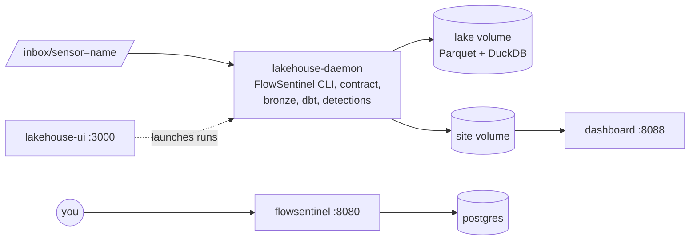

# Running the FlowSentinel Suite

The suite is everything on one machine: FlowSentinel's server and web app, the database it
needs, the lakehouse pipeline, its orchestrator and its dashboard. You drop capture files in a
folder; minutes later they are flows, alerts and charts.

| Service | What it does | Address |
| --- | --- | --- |
| `flowsentinel` | FlowSentinel's server and web app: sign in, upload and explore captures | <http://127.0.0.1:8080> |
| `postgres` | FlowSentinel's database | internal only |
| `lakehouse-ui` | Dagster: runs, assets, data tests, logs | <http://127.0.0.1:3000> |
| `lakehouse-daemon` | Watches the inbox, runs the hourly schedule, executes the runs | internal only |
| `dashboard` | The lakehouse dashboard: alerts, traffic, data quality | <http://127.0.0.1:8088> |
| `redpanda`, `lakehouse-stream` | Optional streaming path (profile `streaming`) | Kafka on `127.0.0.1:19092` |



## Requirements

* Linux with Docker Engine 24 or newer and the Compose plugin 2.20 or newer. Docker Desktop on
  macOS and Windows works too.
* 2 CPU cores and 4 GB of memory. More cores make large captures faster.
* Disk: about 370 MB per million flows for the lake (134 MB of Parquet and 233 MB of warehouse
  per 1.07 million flows in the [benchmark](../README.md#benchmarks)), plus your capture files.
* Internet access for the first build (Rust crates, Python and npm packages).

## Install

Download the source code archive of the
[latest release](https://github.com/exosphere8/flowsentinel-lakehouse/releases/latest) and
unpack it, or clone the repository. Everything happens in `deploy/`:

```bash
cd deploy
./setup.sh                    # once: creates .env, the admin password, inbox/ and config/
docker compose up -d --build  # the first build takes 10 to 20 minutes
docker compose ps             # every service should become "healthy"
```

`setup.sh` prints the FlowSentinel admin password and keeps it in
`secrets/flowsentinel_admin_password`. The database password is in `.env`. Both are random,
both stay on your machine, and `setup.sh` never overwrites them.

## Using it

1. **Add your network** (optional but recommended): copy the examples and edit them, then
   restart the pipeline. See [configuration.md](configuration.md).

   ```bash
   cp config-examples/* config/
   docker compose restart lakehouse-ui lakehouse-daemon
   ```

2. **Drop captures in the inbox**, one folder per sensor or site:

   ```text
   inbox/
     sensor=office/   monday.pcap  tuesday.pcapng
     sensor=dc1/      capture-0001.pcap
   ```

   To keep captures somewhere else, a bigger disk or a share for example, set `INBOX_DIR` in
   `.env`. `.pcap`, `.pcapng` and `.cap` files are decoded by the FlowSentinel CLI inside the
   pipeline. JSON from `flowsentinel flows --json` also works, so a sensor can decode locally
   and ship only flows. pcapng files are converted to pcap first, and captures over a million
   packets are split into parts, so large captures work too (they need free space on the data
   volume about the size of the capture while they are processed).

3. **Watch it run.** The daemon checks the inbox every minute and starts a run when something
   changed; an hourly run (at minute 7) picks up anything else. Each run is visible in Dagster
   on port 3000, with the log of every step and the result of every data test.

4. **Read the results** on the dashboard (port 8088): alerts with their evidence and ATT&CK
   technique, flows per hour by direction, uploads to external hosts, the busiest internal
   hosts, data quality per batch and hostname changes.
   FlowSentinel's own app (port 8080) is for looking at a single capture in detail.

### Copying files in safely

Files are picked up as soon as they appear, so a file that is still being copied could be read
half-written. rsync is safe as it is: it writes to a hidden temporary file and renames it at the
end. With `cp`, `scp` or a file share, copy to a name that starts with a dot and rename it
afterwards; files and folders starting with `.` or `_` are ignored.

```bash
# rsync: safe as it is
rsync -a captures/ server:/opt/flowsentinel/deploy/inbox/sensor=office/
# scp: copy under a hidden name, then rename
scp monday.pcap server:/opt/flowsentinel/deploy/inbox/sensor=office/.monday.pcap
ssh server 'cd /opt/flowsentinel/deploy/inbox/sensor=office && mv .monday.pcap monday.pcap'
```

The pipeline runs as its own user, so files must be readable by everyone (`chmod -R a+rX
inbox`); rsync and tcpdump can create private files. A file the pipeline cannot read is
reported in the run log and tried again on the next run; the others are not held up.

Each file is ingested once; the pipeline remembers it in a ledger, even after a restart. The
inbox is mounted read-only, so ingested files stay where they are until you remove them.

### Streaming

```bash
docker compose --profile streaming up -d --build
```

adds Redpanda and a consumer that writes the `flowsentinel.flows.v1` topic into the lake. Produce
FlowSentinel flow documents to `127.0.0.1:19092`; the hourly run turns them into dashboards.

## Operating

| Task | How |
| --- | --- |
| See what happened | Dagster (port 3000), or `docker compose logs -f lakehouse-daemon` |
| Check the configuration | `docker compose exec lakehouse-daemon flowlake config` |
| Pause the automation | Turn off the `new_landing_files` sensor and the `lakehouse_pipeline_schedule` schedule in Dagster, or `docker compose exec lakehouse-daemon dagster sensor stop new_landing_files -m flowlake.orchestration` (and `dagster schedule stop lakehouse_pipeline_schedule`); `start` turns them back on |
| Run now | Dagster → Jobs → `lakehouse_pipeline` → Materialize all, or `docker compose exec lakehouse-daemon dagster job launch -m flowlake.orchestration -j lakehouse_pipeline` |
| Records that failed the data contract | Dashboard → Data quality, or `quarantine` in the lake |
| Add a FlowSentinel user | FlowSentinel → Users (as an admin) |
| Lost the admin password | Create another admin: `read -rs PW && printf '%s\n' "$PW" \| docker compose exec -T flowsentinel flowsentinel-api create-user --username admin2 --role admin` |
| Stop / start | `docker compose stop` / `docker compose start` |

### Rebuilding everything

After changing network zones, or when the release notes say so, rebuild the incremental models
from the raw data:

```bash
docker compose exec lakehouse-daemon dagster job launch -m flowlake.orchestration \
    -j lakehouse_pipeline --config-json '{"ops": {"dbt_models": {"config": {"full_refresh": true}}}}'
```

The run is queued like any other and shows up in Dagster. (In the Dagster UI, the same
`full_refresh: true` setting can be given in the job's launchpad.) Bronze, the raw layer, is
never rewritten, so a full refresh is always safe.

### Querying the warehouse

The warehouse is a DuckDB file. To query it read-only from inside the suite:

```bash
docker compose exec lakehouse-daemon python -c "
import duckdb
db = duckdb.connect('/data/lake/warehouse.duckdb', read_only=True)
db.sql('select window_start, rule_name, severity, src_ip, dst_ip, dst_name from gold.fct_alerts order by 1 desc').show()
"
```

DuckDB allows one writer, so a query fails with a lock error while a run is writing; try again
when it has finished. Bronze is plain Parquet under `/data/lake/bronze/` and can be read by any
Parquet tool.

### Retention

Nothing is deleted automatically. Remove ingested files from the inbox when you no longer need
them. To drop old flows, stop the pipeline, delete old `ingest_date=` folders under
`/data/lake/bronze/flows/`, and run a full refresh.

## Backup and restore

The state is in four Docker volumes, named after the Compose project (`flowsentinel-suite_` by
default):

| Volume | Contents | Back up? |
| --- | --- | --- |
| `postgres` | FlowSentinel's users, captures and analyses | yes, with `pg_dump` |
| `lake` | bronze Parquet, the warehouse, the ledger, Dagster's run history | yes |
| `site` | the dashboard, rewritten by every run | no |
| `uploads` | uploads while FlowSentinel analyzes them | no |

Plus `deploy/.env`, `deploy/secrets/` and `deploy/config/`.

```bash
mkdir -p backups
docker compose exec -T postgres sh -c 'pg_dump -U "$POSTGRES_USER" -d "$POSTGRES_DB" -Fc' > backups/flowsentinel.dump
docker compose stop lakehouse-daemon lakehouse-ui
docker run --rm -v flowsentinel-suite_lake:/data:ro -v "$PWD/backups:/backup" \
    --user 0 --entrypoint tar flowsentinel-lakehouse:local -czf /backup/lake.tgz --exclude=./tmp -C /data .
docker compose start lakehouse-ui lakehouse-daemon
```

To restore on a fresh install, run `./setup.sh` and put your `.env` and `secrets/` back, then:

```bash
docker compose up -d --no-start
docker run --rm -v flowsentinel-suite_lake:/data -v "$PWD/backups:/backup:ro" \
    --user 0 --entrypoint tar flowsentinel-lakehouse:local -xzpf /backup/lake.tgz -C /data
docker compose up -d postgres
docker compose exec -T postgres sh -c 'pg_restore -U "$POSTGRES_USER" -d "$POSTGRES_DB" --clean --if-exists' < backups/flowsentinel.dump
docker compose up -d --wait
docker compose exec lakehouse-daemon dagster job launch -m flowlake.orchestration -j lakehouse_pipeline
```

The last command rebuilds the dashboard, which is not part of the backup. Keep `backups/`
somewhere safe: it holds everything the suite knows about your network.

## Upgrading

```bash
git pull                      # or unzip the new release over the old folder
docker compose up -d --build
```

Volumes, `.env`, `secrets/` and `config/` are kept. Read the
[changelog](../CHANGELOG.md) first: when an upgrade changes how flows are modeled, it says so,
and you run one full refresh afterwards.

## Security

* **Ports listen on 127.0.0.1 only.** Nothing is reachable from the network until you decide
  how.
* **Dagster has no sign-in.** Anyone who can reach port 3000 can start runs and read logs.
  Reach it through an SSH tunnel (`ssh -L 3000:127.0.0.1:3000 server`), or put it behind a
  reverse proxy that authenticates. The same goes for the dashboard on port 8088, which shows
  internal addresses and alerts.
* **FlowSentinel has its own accounts**, roles, session limits and audit log. To publish it, put
  an HTTPS reverse proxy in front and set `FLOWSENTINEL_ALLOWED_HOSTS=your.host.name` and
  `FLOWSENTINEL_SECURE_COOKIES=true` in `.env`.
* **Secrets** are generated on your machine by `setup.sh`: `.env` is readable only by you and
  `secrets/` is a private folder. Neither is ever committed (`deploy/.gitignore`).
* **Containers are locked down:** they run as unprivileged users with a read-only file system,
  no Linux capabilities (the database keeps the five its entrypoint needs) and
  `no-new-privileges`. The pipeline reads the inbox and the configuration read-only.
* **Captures are sensitive.** FlowSentinel keeps metadata, never payloads, but addresses, names
  and timings still describe your network. Only analyze traffic you own or are authorized to
  inspect.

## Troubleshooting

**A service is not healthy.** `docker compose ps` names it and `docker compose logs <service>`
says why. The pipeline containers refuse to start with an invalid configuration and print the
file, line and reason.

**"is not writable by uid 10001".** A data volume was created by something other than the
lakehouse, for example by an older version of this file. Stop the suite and remove that volume
(the site volume holds nothing that is not rebuilt):
`docker compose down && docker volume rm flowsentinel-suite_site && docker compose up -d`.

**A capture failed.** The run log in Dagster shows the FlowSentinel CLI's message. The CLI stops
at its safety limits (one hour of analysis, a million flows per part). On a small machine, lower
them in `.env`, for example `FLOWLAKE_FLOWSENTINEL_ARGS=--max-duration-seconds 600`. A capture
that was cut short at a limit is still ingested, and the dashboard counts it under data quality.

**The dashboard says "Waiting for data".** No run has finished yet. Check that the files are in
`inbox/sensor=<name>/` and look at the runs in Dagster.

**Building behind a TLS-inspecting proxy.** Give the lakehouse build your proxy's certificate:

```bash
EXTRA_CA_FILE=/path/to/proxy-ca.crt docker compose -f docker-compose.yml -f compose.build-behind-proxy.yml build
```
